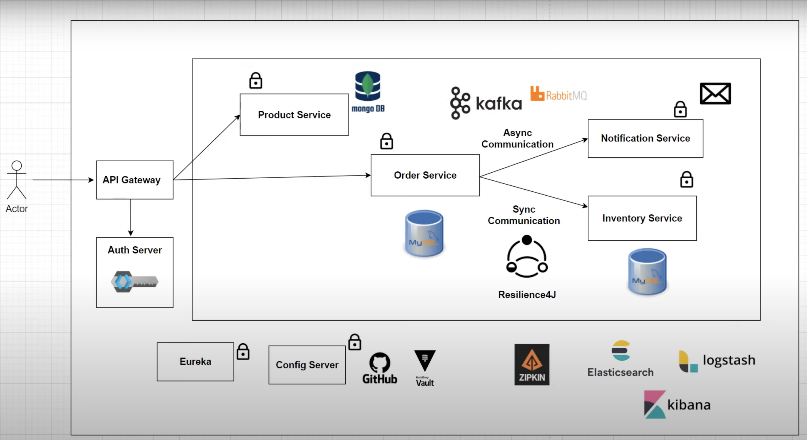

Online Shopping Application
Build Using Spring Boot & Spring Cloud Technologies.

It covers important architectural patterns:
1) Service Discovery
2) Centralized Configuration
3) Distributed Tracing
4) Event Driven Architecture
5) Centralized Logging
6) Circuit Breaker
7) Secure Microservice Using KeyCloak

Services:
1) Product Service: Create and View Products, acts as Product Catalog.
2) Order Service : Can Order Products
3) Inventory Service: To check whether the Product is in Stock or not.
4) Notification Service: Can send notification when order is placed.

Order Service, Inventory Service and Notification Service are going to interact with each other.

Overall Solution Architecture of Project:

Here we have Product Service which is talking to MongoDB
Order Service,Inventory Service which is talking to MySQL DB
Notification Service is stateless responsible to send notifications to users.

OrderService is communicating with Inventory Service (Synchronous Communication)
Order Service is communicating with Notification Service (Asynchronous Communication)

We are using Kafka as Message Queue. 

We have API Gateway -> Acts as a Gate keeper to send users requests to services. 
For Securing Our application we have Auth Server(KeyCloak)

We have different services like Eureka, Config Server, Vault(To store secrets), Zipkin(Distributed Tracing) 
Also, For centralized logging we use Elastic Search, LogStash & Kibana
